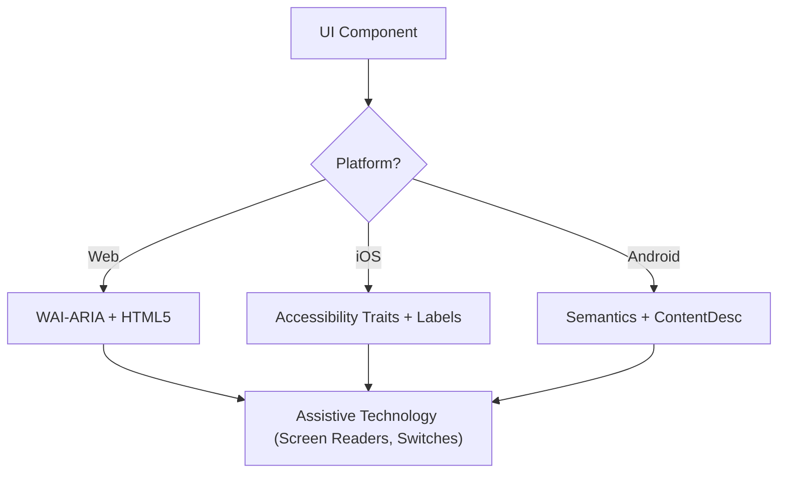

# Accessibility (WCAG 2.2)

This skill ensures that digital interfaces are Perceivable, Operable, Understandable, and Robust (POUR) for all users, including those using screen readers, switch controls, or keyboard navigation. It focuses on the technical implementation of WCAG 2.2 success criteria.

## When to Use

- Defining UI component specifications for Web, iOS, or Android.
- Auditing existing code for accessibility barriers or compliance gaps.
- Implementing new WCAG 2.2 standards like Target Size (Minimum) and Focus Appearance.
- Mapping high-level design requirements to technical attributes (ARIA roles, traits, hints).

## Core Concepts

- **POUR Principles**: The foundation of WCAG (Perceivable, Operable, Understandable, Robust).
- **Semantic Mapping**: Using native elements over generic containers to provide built-in accessibility.
- **Accessibility Tree**: The representation of the UI that assistive technologies actually "read."
- **Focus Management**: Controlling the order and visibility of the keyboard/screen reader cursor.
- **Labeling & Hints**: Providing context through `aria-label`, `accessibilityLabel`, and `contentDescription`.

## How It Works

### Step 1: Identify the Component Role

Determine the functional purpose (e.g., Is this a button, a link, or a tab?). Use the most semantic native element available before resorting to custom roles.

### Step 2: Define Perceivable Attributes

- Ensure text contrast meets **4.5:1** (normal) or **3:1** (large/UI).
- Add text alternatives for non-text content (images, icons).
- Implement responsive reflow (up to 400% zoom without loss of function).

### Step 3: Implement Operable Controls

- Ensure a minimum **24x24 CSS pixel** target size (WCAG 2.2 SC 2.5.8).
- Verify all interactive elements are reachable via keyboard and have a visible focus indicator (SC 2.4.11).
- Provide single-pointer alternatives for dragging movements.

### Step 4: Ensure Understandable Logic

- Use consistent navigation patterns.
- Provide descriptive error messages and suggestions for correction (SC 3.3.3).
- Implement "Redundant Entry" (SC 3.3.7) to prevent asking for the same data twice.

### Step 5: Verify Robust Compatibility

- Use correct `Name, Role, Value` patterns.
- Implement `aria-live` or live regions for dynamic status updates.

## Accessibility Architecture Diagram



## Cross-Platform Mapping

| Feature            | Web (HTML/ARIA)          | iOS (SwiftUI)                        | Android (Compose)                                           |
| :----------------- | :----------------------- | :----------------------------------- | :---------------------------------------------------------- |
| **Primary Label**  | `aria-label` / `<label>` | `.accessibilityLabel()`              | `contentDescription`                                        |
| **Secondary Hint** | `aria-describedby`       | `.accessibilityHint()`               | `Modifier.semantics { stateDescription = ... }`             |
| **Action Role**    | `role="button"`          | `.accessibilityAddTraits(.isButton)` | `Modifier.semantics { role = Role.Button }`                 |
| **Live Updates**   | `aria-live="polite"`     | `.accessibilityLiveRegion(.polite)`  | `Modifier.semantics { liveRegion = LiveRegionMode.Polite }` |

## Examples

### Web: Accessible Search

```html
<form role="search">
  <label for="search-input" class="sr-only">Search products</label>
  <input type="search" id="search-input" placeholder="Search..." />
  <button type="submit" aria-label="Submit Search">
    <svg aria-hidden="true">...</svg>
  </button>
</form>
```

### iOS: Accessible Action Button

```swift
Button(action: deleteItem) {
    Image(systemName: "trash")
}
.accessibilityLabel("Delete item")
.accessibilityHint("Permanently removes this item from your list")
.accessibilityAddTraits(.isButton)
```

### Android: Accessible Toggle

```kotlin
Switch(
    checked = isEnabled,
    onCheckedChange = { onToggle() },
    modifier = Modifier.semantics {
        contentDescription = "Enable notifications"
    }
)
```

## Anti-Patterns to Avoid

- **Div-Buttons**: Using a `<div>` or `<span>` for a click event without adding a role and keyboard support.
- **Color-Only Meaning**: Indicating an error or status _only_ with a color change (e.g., turning a border red).
- **Uncontained Modal Focus**: Modals that don't trap focus, allowing keyboard users to navigate background content while the modal is open. Focus must be contained _and_ escapable via the `Escape` key or an explicit close button (WCAG SC 2.1.2).
- **Redundant Alt Text**: Using "Image of..." or "Picture of..." in alt text (screen readers already announce the role "Image").

## Best Practices Checklist

- [ ] Interactive elements meet the **24x24px** (Web) or **44x44pt** (Native) target size.
- [ ] Focus indicators are clearly visible and high-contrast.
- [ ] Modals **contain focus** while open, and release it cleanly on close (`Escape` key or close button).
- [ ] Dropdowns and menus restore focus to the trigger element on close.
- [ ] Forms provide text-based error suggestions.
- [ ] All icon-only buttons have a descriptive text label.
- [ ] Content reflows properly when text is scaled.

## Deliverable

Do not stop at chat narration — ship a file. Produce a WCAG 2.2 audit report as `accessibility-audit.md` (default: alongside the audited code) containing the per-criterion findings, severity, and concrete fixes, plus the corrected component code written back to its source file(s) (ARIA/traits/labels applied in place). For a spec-only request, write the component spec to `<component>-a11y-spec.md`.

Final verify: confirm the file exists and opens, and spot-check that each Best Practices Checklist item is either satisfied in the code or logged as an open finding in the report.

If the target platform, component, or WCAG scope is missing, still ship the scaffold — the audit report with each POUR section and checklist item stubbed and marked `AWAITING INPUT` — never end with chat-only prose.

## References

- [WCAG 2.2 Guidelines](https://www.w3.org/TR/WCAG22/)
- [WAI-ARIA Authoring Practices](https://www.w3.org/TR/wai-aria-practices/)
- [iOS Accessibility Programming Guide](https://developer.apple.com/documentation/accessibility)
- [iOS Human Interface Guidelines - Accessibility](https://developer.apple.com/design/human-interface-guidelines/accessibility)
- [Android Accessibility Developer Guide](https://developer.android.com/guide/topics/ui/accessibility)

## Related Skills

- `frontend-patterns`
- `frontend-design`
- `liquid-glass-design`
- `swiftui-patterns`
